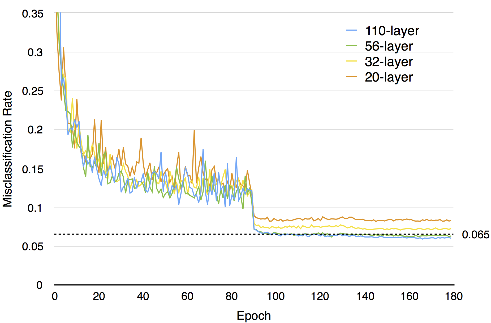
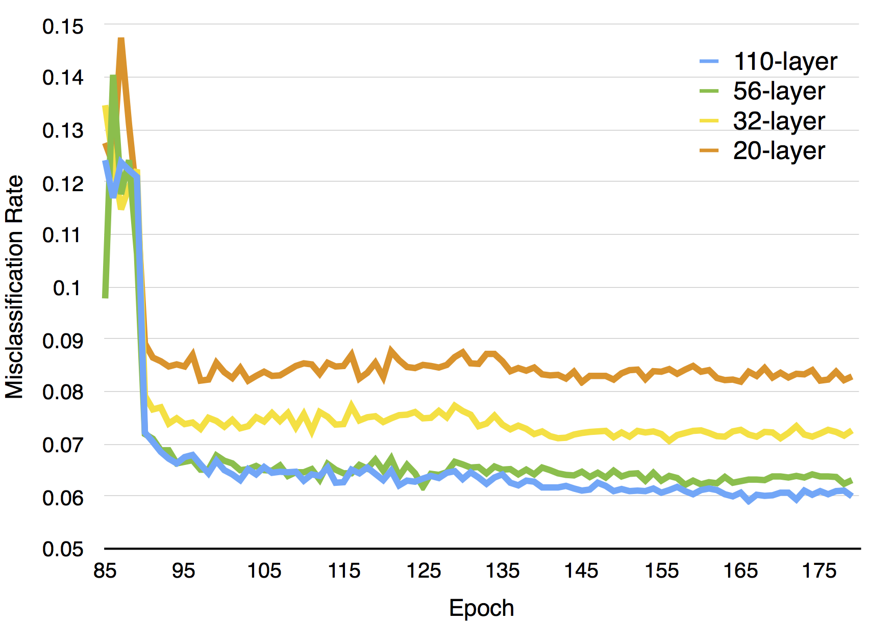

# Model
This is an implementation of the deep residual network used for cifar10 as described in [He et. al.,
"Deep Residual Learning for Image Recognition"](http://arxiv.org/abs/1512.03385).  The model is
structured as a very deep network with skip connections designed to have convolutional parameters
adjusting to residual activations.  The training protocol uses minimal pre-processing (mean
subtraction) and very simple data augmentation (shuffling, flipping, and cropping).  All model
parameters (even batch norm parameters) are updated using simple stochastic gradient descent with
weight decay.  The learning rate is dropped only twice (at 90 and 135 epochs).

### Acknowledgments
Many thanks to Dr. He and his team at MSRA for their helpful input in replicating the model as
described in their paper.

### Model script
The model train script is included ([cifar10_msra.py](./cifar10_msra.py)).

### Trained weights
The trained weights file can be downloaded from AWS

| Model Depth | Model File |
| ----------- | ---------- |
|  20 | [cifar10_msra_020_e180.p](https://s3-us-west-1.amazonaws.com/nervana-modelzoo/cifar10_msra_e180.p) |
|  32 | [cifar10_msra_032_e180.p](https://s3-us-west-1.amazonaws.com/nervana-modelzoo/cifar10_msra_e180.p) |
|  56 | [cifar10_msra_056_e180.p](https://s3-us-west-1.amazonaws.com/nervana-modelzoo/cifar10_msra_e180.p) |
| 110 | [cifar10_msra_110_e180.p](https://s3-us-west-1.amazonaws.com/nervana-modelzoo/cifar10_msra_e180.p) |

### Performance
Training this model with the options described below should be able to achieve above 93.6% top-1
accuracy using only mean subtraction, random cropping, and random flips.

## Instructions
This script was tested with [neon version 1.2](https://github.com/NervanaSystems/neon/tree/v1.2.0).
Make sure that your local repo is synced to this commit and run the [installation
procedure](http://neon.nervanasys.com/docs/latest/user_guide.html#installation) before proceeding.
Commit SHA for v1.2 is  `385483881ee1fe1f0445fc78d7edf5b8ddc5c8c5`

In addition, we use the branch that implements the merge sum layer type.

This example uses the `ImageLoader` module to load the images for consumption while applying random
cropping, flipping, and shuffling.  Prior to beginning training, you need to write out the padded
cifar10 images into a macrobatch repository.  From your top-level neon direcotry, run:

```
neon/data/batch_writer.py \
    --set_type cifar10 \
    --data_dir <path-to-save-batches> \
    --macro_size 10000 \
    --target_size 40
```

Note that it is good practice to choose your `data_dir` to be local to your machine in order to
avoid having `ImageLoader` module perform reads over the network.

Once the batches have been written out, you may initiate training:
```
cifar10_msra.py -r 0 -vv \
    --log <logfile> \
    --epochs 180 \
    --save_path <model-save-path> \
    --eval_freq 1 \
    --backend gpu \
    --data_dir <path-to-saved-batches> \
    --depth <n>
```

The depth argument is the `n` value discussed in the paper which represents the number of repeated
residual models at each filter depth.  Since there are 3 stages at each filter depth, and each
residual module consists of 2 convolutional layers, there will be `6n` total convolutional layers
in the residual part of the network, plus 2 additional layers (input convolutional, and output
linear), making the total network `6n+2` layers deep.  For depth arguments of 3, 5, 9, 18, we get
network depths of 20, 32, 56, and 110.

If you just want to run evaluation, you can use the much simpler script that loads the serialized
model and evaluates it on the validation set:

```
cifar10_eval.py -vv --model_file <model-save-path>
```

## Benchmarks
Machine and GPU specs:
```
Intel(R) Core(TM) i7-4790 CPU @ 3.60GHz
Ubuntu 14.04.2 LTS
GPU: GeForce GTX TITAN X
CUDA Driver Version 7.0
```

The memory usage and per-epoch training time of each network configuration, along with final
validation error is shown in the table below.  We observed that the error rates were consistently
lower than what was cited in the original paper.  Our hypothesis is that this may be due to our
inclusion of a final batch norm transformation at the output affine layer.

| Model Depth  | GPU Memory Footprint | Seconds per Epoch | Validation Error % |
| ------------ | -------------------- | ----------------- | ------------------ |
|  20 |  521 MiB | 11 | 8.29 |
|  32 |  636 MiB | 18 | 7.26 |
|  56 |  860 MiB | 30 | 6.31 |
| 110 | 1277 MiB | 60 | 6.00 |

The total amount of time to train the 56 layer network for 180 epochs was about 90 minutes with the
described machine and GPU specifications.

The evolution of validation misclassification error for the various layer depths can be seen in the
figures below.




